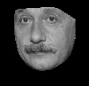
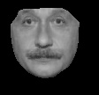
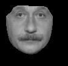
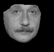
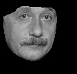

# View Morphing
Final group project for the course TEK5030, spring of 2019.

Goal: Morphing two mirrored images of a face seen from the side to get a front-view of the face. 

## Algorithm overview
1. Selecting at least 8 key-point correspondences between the two images. This was done using the open source dlib tool kit for Python, which estimates the location of 68 facial landmarks. 

2. Calculate the fundamental matrix using the point correspondences. 

3. Pre-warp the images, ie align the image planes, by calculating two projective transform matrices. 

4. Morph the two images. 

5. Post-warp the intermediate morphed image back to the desired image plane. 

More details may be found in the [project report](https://github.com/henriklg/view-morphing/blob/master/project_report.pdf). 

## Examples
#### Straight morph (no view morphing)

#### Einstein view morph

Left image is the original. Rightmost image is the original mirrored. The images inbetween were created using the view morph algorithm. 
